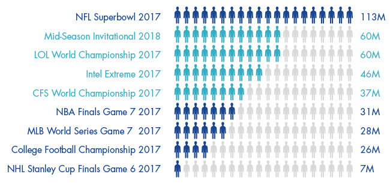

```{r, echo = FALSE, include = FALSE}
# Aviso: si existen errores al compilar puede deberse a:

# 1. Necesidad de incorporar el package "tinytex" [install.packages("tinytex); tinytex::install_tinytex()]
# 2. Necesidad de instalar LaTeX - MiKTeX (https://miktex.org/download)
# 3. Posibles problemas de compilado: seguir pasos en https://yihui.org/tinytex/r/#debugging
```

```{r setup, include = FALSE}
# Configuración de los chunk
knitr::opts_chunk$set(echo = FALSE, 
                      eval = TRUE, 
                      message = FALSE, 
                      warning = FALSE)

# Limpieza inicial del entorno
rm(list = ls())

# Instalación de paquetes no instalados
packages <- c("tidyr", "dplyr", "ggplot2", "knitr", 
              "readxl", "tibble", "kableExtra", "gt", 
              "corrplot", "factoextra", "igraph", "aplpack", "GGally")
installed_packages <- packages %in% rownames(installed.packages())
if (any(installed_packages == FALSE)) {
  install.packages(packages[!installed_packages])
}

# Activación de paquetes
library(xaringanthemer)
library(tidyr)
library(dplyr)
library(ggplot2)
library(knitr)
library(readxl)
library(tibble)
library(kableExtra)
library(gt)
library(corrplot)
library(factoextra)
library(igraph)
library(aplpack)
library(GGally)
```

# Resumen

El mundo de los *eSports* ha sufrido un auge en la última década de gran relevancia. Ello se ha visto auspiciado por aspectos como su popularización en el mundo *gaming*, aspecto que viene directamente relacionado, también, por su impulso a través de canales de retransmisión en directo (o también denominado *streaming*) como YouTube o Twitch. Todo ello está también vinculado a la generación de un impacto económico que resulta de interés. Por lo tanto, el objetivo general de este informe[^1] será analizar la importancia del mercado de *eSports* frente a los medios tradicionales y su impacto en la economía de los países.

[^1]: Este informe ha sido realizado con el software R, a través del entorno RStudio y se ha maquetado, mediante R Markdown, a partir de las ayudas de libros, artículos y clases de @Allaire2021, @Casero2021, @Cano2021, @CRANR-Project2021, @DataCamp2021a, @Hlavac2018, @Keyes2019, @Kobi2010, @Luque2019, @Luque2019b, @VanHespen2016, @Xie2021, @Xie2021a y @Zhu2019. También se ha tenido que recurrir a la instalación de MiKTeX (<https://miktex.org/>). Los datos se han importado de un archivo Microsoft&reg; Excel&reg;.

# 1. Introducción

Los años 70 supusieron el inicio de una transformación en el mundo de los videojuegos (o *gaming*) que ha evolucionado de forma transcendental hasta el día de hoy y que, junto a internet y la nueva era digital, ha supuesto un cambio de paradigma [@Martin2019]. Así, el año 2019 quedó marcado por el *"sorpasso"* que se observó en el consumo de medios digitales frente a los medios de comunicación tradicionales [@Mena2020]. Esto se corrobora, según datos de @AIMC2021, con el descenso del consumo de diarios, radio o televisión, frente al crecimiento continuo del consumo digital en internet y de las plataformas *streaming* (OTT).

En este sentido, un concepto y ámbito que ha adquirido gran relevancia ha sido el de los *eSports* [^2] o deportes electrónicos, los cuales pueden definirse como las competiciones de videojuegos deportivos, bajo una organización reglada (ligas, torneos, etc.) que se realizan entre diversos jugadores (multijugador), y donde es frecuente su retransmisión en directo (en plataformas tan populares como Twitch), la entrega de premios con elevadas cantidades de dinero asociadas o su profesionalización [@TechLib2021; @Agustin2016; @IMS2019; @Casells2021\]. El propio @Wagner1999, ya definía, hace más de una década, los deportes electrónicos como un *"área de actividades deportivas donde las personas desarrollan y obtienen capacidades mentales o físicas en el uso de las tecnologías de la información y la comunicación"*. Fuentes consultadas rebelan que, en 2020, hasta un 30% de la población española habría desembolsado dinero para acceder a contenido relacionado con los *eSports* [@Orus2021].

[^2]: La Real Academia Española (RAE), a través del Observatorio de Palabras, en su recomendación para el uso alternativo al anglicismo, define este concepto como "ciberdeportes" o "deportes electrónicos" [@RAE2021].

Así, dichos *eSports* se diferencian principalmente de los deportes tradicionales en aspectos como el espacio de juego [@Agustin2016], aunque han adquirido un modelo organizativo y económico que replica a los propios del deporte tradicional, existiendo normas y reglamentaciones, patrocinadores (esponsorización), eventos internacionales que suponen un considerable movimiento de millones de euros o la propia profesionalización del sector [@Agustin2016; @IMS2019; @TechLib2021]. De hecho, incluso algunos países reconocen a los jugadores de deportes electrónicos como "atletas" por su exigencia similar a la de otros deportes tradicionales [@MovistareSports2018].

Por otra parte, el mayor auge de los *eSports* se ha demostrado que viene dado por diversos elementos. En primer lugar, parece evidente que uno de los principales aspectos que hace atractivo a los deportes electrónicos es el factor de competitividad, aunque a ello se asocia también, tal y como indican @Lee2011, aspectos como el reconocimiento social y las relaciones generadas en dicho ecosistema[^3]. Por ejemplo, determinadas consultoras han demostrado que las personas que se relacionan en este mundo de los deportes electrónicos se sitúan en mejores esferas laborales y sociales [@MovistareSports2018]. Pero también otro factor que impulsa este auge es el creciente número de visualizaciones de las competiciones de *eSports*, hecho que hace que se esté integrando cada vez más a través de la retransmisión en directo de las competiciones y su posterior retroalimentación en las diferentes redes sociales existentes.

[^3]: Diversas investigaciones y estudios han demostrado el factor social que existe detrás del mundo de los deportes electrónicos. Por ejemplo, es de interés señalar la existencia de comunidades que promueven valores como la igualdad, el respeto, el trabajo en equipo o la superación a través de este sector. Ejemplo a comentar es *Junios Esports*, una comunidad de competición de *eSports* que integra al mundo educativo (centros educativos, docentes y estudiantes) para promover valores a través de diversas iniciativas relacionadas con los deportes electrónicos (competiciones, formación, encuentros, etc.) [@JuniorEsports2021; @JuniorEsports2021a].

Por otro lado, la oportunidad que supone el sector se está traduciendo en las elevadas inversiones que se están realizando desde fondos de capital riesgo y de capital privado, lo que supone un respaldo y consolidación económica que da vía libre al crecimiento exponencial del ecosistema de los deportes electrónicos [@InsiderIntelligence2021]. Es importante también considerar que la publicidad, patrocinio y popularización de los *eSports* entre celebridades, *influencers*, deportistas profesionales de deportes tradicionales y las sinergias en plataformas como Twitch o su utilidad para el uso de juegos como, por ejemplo, *Valorant*, *Counter Strike (CS:GO)*, *DOTA 2* o *League of Legends*, han contribuido también a todo este proceso [@InsiderIntelligence2021].

En esta misma línea, por ejemplo, en 2018, el 80% del contenido en la plataforma Twitch estaba relacionada con los *eSports* [@MovistareSports2018], y por otra parte, celebridades como Mascherano, Fernando Alonso, las propias ligas de fútbol (LaLiga), los clubes de fútbol tradicionales o las tecnológicas Amazon y Facebook se han apuntado a esta tendencia [@MovistareSports2018]. De hecho, en septiembre de 2021, el sector de los deportes electrónicos saltaba en las portadas de los principales medios de comunicación por la creación de un equipo en la Superliga 2022 del popular videojuego *League of Legends (LOL)* por parte del ex futbolista Gerard Piqué y el *streamer* Ibai Llanos, operación que podría haber costado alrededor de 300 mil euros [@Pacheco2021]. Por otra parte, el mundo de los deportes electrónicos forma parte de un sector de los videojuegos que en 2019 ya tenía un mercado superior al conjunto del sector de la música y el cine [@Mangeloja2019].

Un comentario que también debe realizarse cuando se contextualiza este mercado, es la importancia que está adquiriendo a nivel económico, suponiendo una fuente de creación de empleo, de impulso de la economía o de las retroalimentaciones entre los individuos/entidades/instituciones que se encuentran de forma, directa o indirecta, en el ecosistema [@Garcia2020].

Es por todo ello por lo que nos encontramos ante un auténtico ecosistema que es digno de situarse, conforme al avance del propio sector, al nivel de deportes profesionales tradicionales como el fútbol (ej.: *Champions League*, *Premier*, etc.) o el baloncesto (ej.: NBA, ACB, etc.), así como ser una gran oportunidad con implicaciones socioeconómicas relevantes. Por ejemplo, veamos el siguiente gráfico donde muestra el volumen de espectadores de grandes espectáculos de deportes tradicionales frente a eventos de deportes electrónicos en Estados Unidos [@VanEck2018]:

```{r, fig.align = 'center'}

```

En definitiva, bajo este marco contextual, resulta de interés analizar la importancia del mercado de los deportes electrónicos o *eSports* y su impacto en la economía de los países. Para ello se desarrolla este informe que se estructura en un primer capítulo, el actual, donde se ha expuesto el marco contextual de la investigación. En segundo lugar, en el capítulo 2, se procederá a explicar el tratamiento de los datos recopilados para la investigación para, en un tercer capítulo, describir los datos analizados. En el cuarto capítulo se expondrán las conclusiones más relevantes de la investigación. Por último se incluirán las referencias bibliográficas utilizadas, así como los anexos complementarios que reflejan información relevante para el desarrollo del informe (gráficos, datos, código o *script* utilizado para elaborar el informe, datos de la sesión de R, etc.).

# 2. Tratamiento de datos

En este segundo capítulo se procederá a comentar, sucintamente, cómo se ha llevado a cabo el tratamiento de los datos recopilados.

1. En primer lugar cabe decir que la **base de datos** se ha obtenido de una página web que recopila datos de _eSports_ sobre trofeos y ganancias a nivel mundial de forma colaborativa. En concreto, la página web se denomina _Esports Earnings_ (<https://www.esportsearnings.com>), y, tal y como ellos mismos definen, se basan en una comunidad de *"información pública de libre acceso"* [@ESportsEarnings2021].

```{r, fig.align = 'center'}

```

2. El proceso de **obtención de los datos** ha requerido del "copiado y pegado" manualmente de los datos de interés en un archivo de Microsoft&reg; Excel&reg; (.xlsx), pues el portal web _Esports Earnings_ no da la posibilidad de exportar datos en formato .xlsx, .csv o alternativo.

3. Para el **tratamiento de datos** se ha requerido de dos bloques de trabajo diferenciados.

  + En el propio archivo .xlsx se han tenido que depurar los datos y ajustar en las distintas hojas de Excel para su correcta importación a R.
  + Ya una vez importados los datos en R, el tratamiento ha pasado por la eliminación de datos perdidos (*missing values*), cambio de puntos (.) por comas (,), así como acciones de filtrado, ordenación, selección, etc. Cabe también comentar que los datos monetarios de origen estaban en dólares ($), por lo que se han convertido dichos datos a moneda de la zona euro (€), según el tipo de cambio del Banco Central Europeo (BCE), el cual estaba establecido, a 26 de octubre de 2021, a `USD 1 = EUR 0.8607` [@EuropeanCentralBank2021].

```{r, include = FALSE}
# Importación de datos (i)
forbes_20 <- readxl::read_excel("TAEDE_trabajo_database.xlsx", 
                                sheet = "forbes_20")

# Importación de datos (ii)
top_paises_19 <- read_excel("TAEDE_trabajo_database.xlsx", 
                            sheet = "top_paises_19")

top_paises_19 <- top_paises_19 %>% 
  data.frame(row.names = 1)

top_paises_20 <- read_excel("TAEDE_trabajo_database.xlsx", 
                            sheet = "top_paises_20")

top_paises_20 <- top_paises_20 %>% 
  data.frame(row.names = 1)

# Eliminación missing values
top_paises_19 %>% 
  filter(is.na(INGC_DOL) | is.na(JUG))

top_paises_19 <- top_paises_19 %>% 
  filter(! is.na(INGC_DOL) & ! is.na(JUG))

top_paises_20 %>% 
  filter(is.na(INGC_DOL) | is.na(JUG))

top_paises_20 <- top_paises_20 %>% 
  filter(! is.na(INGC_DOL) & ! is.na(JUG))

# Conversión monetaria a euros
top_paises_19 <- top_paises_19 %>% 
  add_column(INGC_EUR = top_paises_19$INGC_DOL*0.8607)

top_paises_20 <- top_paises_20 %>% 
  add_column(INGC_EUR = top_paises_20$INGC_DOL*0.8607)

# Eliminación de la columna INGC_DOL
top_paises_19 <- top_paises_19 %>% 
  subset(select = c(INGC_EUR, JUG))

top_paises_20 <- top_paises_20 %>% 
  subset(select = c(INGC_EUR, JUG))

# Ordención de datos de mayor a menor según INGC_EUR
top_paises_19 <- top_paises_19 %>% 
  arrange(desc(INGC_EUR))

top_paises_20 <- top_paises_20 %>% 
  arrange(desc(INGC_EUR))

# Importación de datos (iii)
top_juegos_20 <- read_excel("TAEDE_trabajo_database.xlsx", 
                            sheet = "top_juegos_20")

top_juegos_20 <- top_juegos_20 %>% 
  mutate(JUEGO = as.integer(JUEG))

# Eliminación missing values
top_juegos_20 %>% 
  filter(is.na(DOL_DIS) | is.na(JUG) | is.na(TOR))

top_juegos_20 <- top_juegos_20 %>% 
  filter(! is.na(DOL_DIS) & ! is.na(JUG) & ! is.na(TOR))

# Conversión monetaria a euros
top_juegos_20 <- top_juegos_20 %>% 
  add_column(EUR_DIS = (top_juegos_20$DOL_DIS*0.8607)/1000)

# Eliminación columna DOL_DIS y JUEGOS
top_juegos_20 <- top_juegos_20 %>% 
  subset(select = c(JUEG, EUR_DIS, JUG, TOR))

# Importar base de datos serie temporal (iv)
serie_temporal <- read_excel("TAEDE_trabajo_database.xlsx", 
                             sheet = "serie_temporal")

# Eliminación de missing values
serie_temporal %>% 
  filter(is.na(PM_DOL) | is.na(MPM_DOL) | is.na(MIJ_DOL) | is.na(MDIJ_DOL) | is.na(MDPM_DOL) | is.na(TOR) | is.na(JUG_AC))

serie_temporal <- serie_temporal %>% 
  filter(! is.na(PM_DOL) & ! is.na(MPM_DOL) & ! is.na(MIJ_DOL) & ! is.na(MDIJ_DOL) & ! is.na(MDPM_DOL) & ! is.na(TOR) & ! is.na(JUG_AC))

# Conversión monetaria a euros
serie_temporal <- serie_temporal %>%
  mutate(YEAR = as.integer(Año)) %>% 
  add_column(PM_EUR = (serie_temporal$PM_DOL*0.8607)/1000) %>%
  add_column(MPM_EUR = (serie_temporal$MPM_DOL*0.8607))%>%
  add_column(MIJ_EUR = (serie_temporal$MIJ_DOL*0.8607))%>%
  add_column(MDPM_EUR = (serie_temporal$MPM_DOL*0.8607)) %>% 
  add_column(MDIJ_EUR = (serie_temporal$MDIJ_DOL*0.8607)) %>% 
  subset(select = c(YEAR, TOR, JUG_AC, PM_EUR, MPM_EUR, MIJ_EUR, MDPM_EUR, MDIJ_EUR))
```

# 3. Análisis de los datos

En este tercer capítulo se va a proceder a realizar un análisis exploratorio de los datos recopilados para este informe. Principalmente se analizará el ámbito de los _eSports_ desde el punto de vista de su impacto económico en los países, la evolución a lo largo de los últimos años y los equipos y juegos que mayor relevancia tienen.

Previamente a desarrollar el capítulo, es fundamental definir las variables utilizadas:

```{r}
# Importación de la hoja que contiene las variables definidas originales (vi)
definiciones <- read_excel("TAEDE_trabajo_database.xlsx", 
                           sheet = "def_vbles")

# Eliminación de filas de las variables transformadas de dólares a euros
definiciones <- definiciones[-c(7:13), ]

# Creación del data.frame que incorporará las nuevas filas
def_7 <- data.frame("EUR_DIS", 
                    "Total dinero distribuido (euros)")
def_8 <- data.frame("PM_EUR", 
                    "Total premio monetario  (euros)")
def_9 <- data.frame("MPM_EUR", 
                    "Media de premios monetarios (euros)")
def_10 <- data.frame("MIJ_EUR", 
                     "Media de ingresos por jugador (euros)")
def_11 <- data.frame("MDPM_EUR", 
                     "Mediana de premios monetarios (euros)")
def_12 <- data.frame("MDIJ_EUR", 
                     "Mediana de ingresos por jugador (euros)")
def_13 <- data.frame("INGC_EUR", 
                     "Ingresos competiciones (euros)")

# Descripción de los datos incorporados en la nueva fila
names(def_7) <- c("Variable", 
                  "Descripción")
names(def_8) <- c("Variable", 
                  "Descripción")
names(def_9) <- c("Variable", 
                  "Descripción")
names(def_10) <- c("Variable", 
                   "Descripción")
names(def_11) <- c("Variable", 
                   "Descripción")
names(def_12) <- c("Variable", 
                   "Descripción")
names(def_13) <- c("Variable", 
                   "Descripción")

# Incorporación de las nuevas filas
definiciones <- rbind(definiciones, 
                      def_7)
definiciones <- rbind(definiciones, 
                      def_8)
definiciones <- rbind(definiciones, 
                      def_9)
definiciones <- rbind(definiciones, 
                      def_10)
definiciones <- rbind(definiciones, 
                      def_11)
definiciones <- rbind(definiciones, 
                      def_12)
definiciones <- rbind(definiciones, 
                      def_13)

# Creación de una tabla
definiciones %>% 
  kable(booktabs = TRUE, 
        format = "latex",
        caption = "Definición de variables") %>%
  kable_styling(font_size = 8,
                latex_options = c("striped", 
                                  "condensed", 
                                  "hold_position"), 
                position = "center", 
                full_width = FALSE) %>% 
  column_spec(1, bold = T, 
              color = "black") %>% 
  column_spec(2, width = "30em")
```

## 3.1. Valoración de equipos

Actualmente existen miles de equipos *eSports* repartidos por cientos de países y vinculados a uno o más juegos. En este sentido, según señala @Settimi2020, investigadora de Forbes, la empresa de *eSports* con mayor valor en 2020 fue TSM, con aproximadamente 410 millones de dólares, seguidas de otras como Nube9, Equipo Líquido o ClanFaze (todas ellas con un valor superior a los 300 millones de dólares y con ingresos de explotación que superan prácticamente los 30 millones de dólares).

A pesar de estos datos, y de que estas empresas están dedicadas al ecosistema *eSports*, tal y como se puede ver a continuación, las empresas que mayor dinero obtienen, de forma directa, de *eSports* son Equipo Líquido y G2 Esports.

```{r}
forbes_20_coef <- forbes_20 %>% 
  filter(COEFICIENTE > 0.5) %>% 
  select (Empresa, COEFICIENTE, VALOR, ING_ESTIMADOS) %>% 
  arrange(desc(COEFICIENTE))

forbes_20_coef %>%
  gt() %>%
  tab_header(title = "Empresas con mayores ingresos procedentes de eSports") %>%
  cols_label(COEFICIENTE = "Coef. ingresos eSports", VALOR = "Valor", ING_ESTIMADOS = "Ing. estimados") %>%
  tab_source_note(source_note = "Fuente: Settimi (2020)")
```

También podemos ver estos datos gráficamente:

```{r, fig.height = 8, fig.width = 15}
forbes_20 %>% 
  ggplot(aes(x = Empresa, y = COEFICIENTE)) +
  xlab('Empresa') +
  ylab('Coeficiente (%)') +
  geom_col(bins = 20, 
           colour = 'black', 
           fill = 'turquoise4') + 
  ggtitle('Porcentaje de ingresos directamente procedentes de los eSports') +
  theme_minimal() +
  theme(axis.text.x = element_text(angle = 90, 
                                   size = 15, 
                                   hjust = 1, 
                                   vjust = 1),
        axis.text.y = element_text (size = 15))
```

Por otra parte, según datos de @Newzoo2021[^4], en 2021 se prevé, a nivel global, una suma total de **ingresos procedentes de los *eSports*** que alcanzará aproximadamente los 1.080 millones de dólares. En la misma línea, la **audiencia global** se estima que alcanzará los 730 millones de personas, habiendo un crecimiento de 557 millones en audiencia para el año 2021. Otro dato que revela el informe de @Newzoo2021 es el elevado crecimiento que está teniendo este mercado en cuanto a los usuarios que hablan español y portugués, hecho que muestra que también podría existir un factor cultural de integración, vía idioma, en el desarrollo del sector.

[^4]: *Newzoo* es una de las más importantes consultoras especializada en el sector de los videojuegos y deportes electrónicos. De esta forma, elabora diferentes análisis e investigaciones para mostrar la situación del sector y asesorar a empresas, medios de comunicación, inversores, etc. Página web: <https://newzoo.com/>.

## 3.2. Análisis por países

El mercado *eSports* ha tenido un desarrollo a nivel global muy relevante en los últimos años. Así, de media, en 2020, los `r count(top_paises_20)` países de la muestra obtuvieron una media de `r mean(top_paises_20$INGC_EUR)` euros de ingresos procedentes de competiciones. Por su parte, la media de jugadores en 2020 fue de `r mean(top_paises_20$JUG)`. Este último dato contrasta con el país que tuvo un mayor número de jugadores, el cual ascendió a `r max(top_paises_20$JUG)`. En otro sentido, esto puede verse en el siguiente gráfico, donde se muestran los niveles de ingresos de competiciones por países en el año 2020.

```{r, fig.height = 5, fig.width = 15}
top_paises_20 %>% 
  ggplot(aes(x = row.names(top_paises_20), 
             y = INGC_EUR)) +
  geom_point(size = 2, 
             alpha = 1, 
             colour = 'turquoise4') +
  xlab('País') +
  ylab('Ingresos competiciones (eur)') +
  ggtitle('Ingresos de competiciones por países en 2020') +
  theme_minimal() +
  theme(axis.text.x = element_text(angle = 90, 
                                   size = 10, 
                                   hjust = 1, 
                                   vjust = 1))
```

Si acotamos la muestra a los países que obtienen más de 1 millón de euros en ingresos de competiciones, vemos que, en 2020, fueron Estados Unidos (USA), China (CHN) y Corea del Sur (KOR). Así, la implantación de los deportes electrónicos en países como Corea del Sur (KOR) llega a tal y nivel que, incluso, ganar en los *Juegos Asiáticos de Hangzhou 2022* te podría hacerte "inmune" a pasar por el servicio militar de dicho país [@Marca2021].

```{r, fig.height = 5, fig.width = 15}
# Filtrado jugadores
top_paises_20_filtrado1 <- top_paises_20 %>% 
  filter (INGC_EUR > 1000000)

top_paises_20_filtrado1 %>% 
  ggplot(aes(x = row.names(top_paises_20_filtrado1), 
             y = INGC_EUR)) +
  geom_point(size = 2, alpha = 1, 
             colour = 'turquoise4') +
  xlab('País') +
  ylab('Ingresos competiciones (eur)') +
  ggtitle('Ingresos de competiciones por países en 2020') +
  theme_minimal() +
  theme(axis.text.x = element_text(angle = 90, 
                                   size = 10, 
                                   hjust = 1, 
                                   vjust = 1))
```

En esta misma línea, cabría esperar que los países que mayor número de jugadores de _eSports_ tienen, también sean los que más dinero, en términos de competiciones, reparten. Viendo las correlaciones, esto, preliminarmente se confirma, tanto para 2019 como para 2020.

```{r, fig.align = 'center', fig.height = 2, fig.width = 5}
top_paises_19_cor <- cor(top_paises_19 %>% 
                       select(where(is.numeric)))

top_paises_19_cor %>% 
  corrplot(method = "color", 
           order = "hclust",
           caption = "hola")

top_paises_20_cor <- cor(top_paises_20 %>% 
                       select(where(is.numeric)))
top_paises_20_cor %>% 
  corrplot(method = "color", 
           order = "hclust",
           caption = "hola")
```

Por otro lado, a pesar de lo anteriormente dicho, y conforme se ha visto a los gráficos anteriores, el gráfico de dispersión nos da ciertas pistas de que existen algunos países que están teniendo un comportamiento, posiblemente atípico, del resto de países. 

```{r, fig.align = 'center', fig.height = 4, fig.width = 10}
top_paises_19 %>% 
  select(INGC_EUR, JUG) %>% 
  ggplot(aes(INGC_EUR, JUG)) +
  geom_point(size = 2, 
             alpha= 0.7, 
             color = "orange") +
  ggtitle("Dispersión en 2019 (ingresos y jugadores)") +
  geom_smooth(color = "turquoise4") +
  xlab('Ingresos de competiciones') +
  ylab ('Número de jugadores') +
  theme_minimal()

top_paises_20 %>% 
  ggplot(aes(x = INGC_EUR,
             y = JUG,
             colour = INGC_EUR,
             size = JUG)) +
  geom_point(size = 2, 
             alpha= 0.7) +
  ggtitle("Dispersión en 2020 (ingresos y jugadores)") +
  xlab('Ingresos de competiciones') +
  ylab ('Número de jugadores') +
  theme_minimal()
```

Si aplicamos el análisis de datos atípicos para el año 2020, que es donde aparentemente hay más, se confirma que existen. A pesar de ello vamos a mantener todos los datos.

```{r, fig.align = 'center', fig.height = 4, fig.width = 10}
top_paises_20 %>% 
  ggplot(aes(x = INGC_EUR,
             y = JUG)) +
  geom_boxplot(alpha = 0.5, fill = "grey", color = "turquoise4") +
  xlab('Ingresos de competiciones (euros)') +
  ylab('Número de jugadores') +
  ggtitle('Posibles outliers') +
  theme_minimal()
```

Estas diferencias de comportamiento de los datos atípicos se pueden visualizar, "poniéndole cara" de forma gráfica a los países que representan estos datos atípicos (USA, CHN y KOR).

```{r, fig.align = 'center', fig.height = 5, fig.width = 10}
top_paises_20_filtrado1 %>% 
  faces(cex = 0.8,
        print.info = FALSE,
        face.type = 2)
```

Por último, si quisieramos trazar un mapa mental de qué países están agrupados por posibles comportamientos similares, para el caso de 2020, podríamos plantear un clúster jerárquico a partir de las distancias euclídeas y el método de Ward. Por tanto, hemos expuesto de forma exploratoria el siguiente gráfico, el cuál nos muestra cómo Estados Unidos y China, claramente, son dos países que conforman, como habíamos visto anteriormente, casos particulares. También se pueden ver claramente diferenciados otros dos grupos de países que podrían formar un clúster.

```{r, fig.align = 'center', fig.height = 6, fig.width = 10}
ward_hc <- hcut(top_paises_20, k = 4,
                func_hc = "hclust", hc_metric = "euclidean", hc_method = "ward.D2")
set.seed(100)
fviz_dend(x = ward_hc, k = 4,
          k_colors = c("blue3", "green4", "red4", "turquoise4"),
          color_labels_by_k = TRUE,
          cex = 0.8,
          type = "phylogenic",
          repel = TRUE)
```

## 3.3. Análisis por juegos

En este apartado se va a proceder a analizar el ámbito de los _eSports_ desde la perspectiva de los juegos involucrados en este ecosistema. Cabe decir que el incremento de los premios en los torneos de eSports de forma continua, beneficia el crecimiento de la industria competitiva. Cada año más jugadores de la élite de los videojuegos profesionales se convierten en estrellas, impulsados por sus ganancias económicas [@JDStyle2021].

En el año 2020 se desarrollaron un total de 197 juegos profesionales de _eSports_ donde se repartieron más de 120 millones de euros en premios. La pandemia provocada por la Covid-19 obligó a cancelar o reprogramar muchos de los principales eventos del negocio y por ello las ganancias disminuyeron en torno a un 65,5% con respecto a 2019. Pese a ello, muchas competiciones se adaptaron a la situación excepcional y actualmente se encuentran recuperando su entorno competitivo [@Golsmedia2021].

Los datos obtenidos de @ESportsEarnings2021 muestran que las diez primeras posiciones de los juegos que mayor dinero distribuyeron en 2020 ostentan casi un 70% del dinero total generado para los equipos competitivos. *League of Legends*, *Fornite* o *Call of Duty*, entre otros, se cuelan en esta lista prestigiosa, donde todos han generado más de 5 millones de euros y sus jugadores se incrementan año tras año [@Mane2020].

```{r, fig.height = 5, fig.width = 10}
# Filtramos y obtenemos los 10 juegos que mas dinero han repartido en premios, por encima de 400.000€.
top_juegos_20_10 <- top_juegos_20 %>% 
  filter(EUR_DIS > 4000)

# Gráfico
top_juegos_20_10 %>% 
  ggplot(aes(x = EUR_DIS, 
             y = JUEG)) + 
  xlab('Dinero distribuido (mil. eur.)') +
  ylab('Juego') +
  geom_col(bins = 5, 
           colour = 'black', 
           fill = 'turquoise4') +
  ggtitle('Juegos con mayor distribución monetaria en 2020') +
  theme_minimal()
```

En el top de juegos que han repartido más dinero en 2020 (`EUR_DIS`) se encuentra *Counter-Strike: Global Offensive*, con una cifra cercana a los 13 millones de euros, un videojuego de disparos en primera persona que desde su lanzamiento, hace 10 años, ha tenido un promedio de 11 millones de usuarios al mes [@Block2021].

Seguidamente, y con un total de 8,2 millones de euros, se encuentra *Arena of Valor*, un videojuego para móviles basado en un mundo multijugador en tercera persona, donde se enfrentan varios personajes con el objetivo de destruir la fortaleza enemiga. Desde su lanzamiento en 2016 ha tenido un crecimiento continuo y se sitúa como el videojuego para móviles preferido por los espectadores [@Guinon2019].

Por otra parte, la popularidad del juego *Dota 2* es evidente, y aunque se sitúe en tercera posición, los 20 jugadores con más ganancias de la historia de los *eSports* lo han elegido como su especialidad. Es un juego multijugador basado en una arena de batalla, donde los participantes deben construir su base y destruir la enemiga. Su lanzamiento se produjo en 2013 y la élite de los deportes electrónicos obtiene la mayoría de sus ganancias a través de este juego [@JDStyle2021].

```{r, echo = FALSE, fig.height = 5, fig.width = 10}
# Filtramos y obtenemos los 3 juegos que mas dinero han repartido en premios, por encima de 800.000€.
top_juegos_20_3 <- top_juegos_20 %>% 
  filter(EUR_DIS > 8000)

# Gráfico
top_juegos_20_3 %>% 
  ggplot(aes(x = JUEG, 
             y = EUR_DIS)) +
  xlab('Juego') +
  ylab('Dinero distribuido (mil. eur.)') +
  geom_col(bins = 20, 
           colour = 'black', 
           fill = 'turquoise4') + 
  ggtitle('Top 3 juegos con mayor distribución monetaria en premios en 2020') +
  theme_minimal()
```

En cuanto al número de torneos competitivos por juego (`TOR`), se han seleccionado los juegos que han desarrollado más de 50 eventos durante todo el año, con el objetivo de que el análisis sea representativo sobre el total.

*Counter-Strike: Global Offensive* se encuentra de nuevo en la primera posición, la gran cantidad de torneos que se desarrollaron durante el 2020 (595) está relacionado con ser el juego que más dinero generó en premios. El segundo clasificado en este aspecto, *Arena of Valor*, no se encuentra entre los juegos que más torneos desarrollaron durante el 2020, por ello, sus 8 millones de euros se repartieron en solo 13 eventos. El juego *Dota 2*, que ostenta la tercera posición en cuanto a dinero generado, desarrolló un total de 158 torneos competitivos.

Este análisis demuestra que los juegos que más dinero distribuyen en concepto de premios no son los que más eventos desarrollan a lo largo del año. Salvo el primer clasificado, *Counter-Strike: Global Offensive*, las siguientes posiciones en cuanto a cantidad de torneos están ocupadas por juegos que no se encuentran en el top 10, como *Rocket League*, *Valorant* o *StarCraft II* cuyos premios no ascienden de 3 millones de euros.

```{r, fig.height = 5, fig.width = 10}
# Filtrado de torneos
top_juegos_tor <- top_juegos_20 %>% 
  filter(TOR > 50) 

# Gráfico
top_juegos_tor %>% 
  ggplot(aes(x = TOR, 
             y = JUEG)) +
  xlab('Nº de torneos') +
  ylab('Juego') +
  geom_col(bins = 20, 
           colour = 'black', 
           fill = 'turquoise4') +
  ggtitle('Nº de torneos por juegos organizados en 2020') +
  theme_minimal()
```

En cuanto a los juegos competitivos más jugados durante el 2020 (`JUG`), medido por el número de jugadores por cada juego, se encuentra en primera posición *Counter-Strike: Global offensive* con casi 3.000 jugadores profesionales. En segunda posición se encuentra *Valorant* con un total de 2.200 jugadores. En tercera y cuarta posición, con números muy cercanos, se sitúan *League of Legends* y *Fornite*, con 1.700 y 1.600 jugadores respectivamente [@SeccioNNoticias2020].

```{r, fig.height = 5, fig.width = 10}
# Filtrado jugadores
top_juegos_players <- top_juegos_20 %>% 
  filter (JUG > 300)

# Gráfico
top_juegos_players %>% 
  ggplot(aes(x = JUG, 
             y = JUEG)) + 
  xlab('Nº de jugadores') +
  ylab('Juego') +
  geom_col (bins = 5,
            colour = 'black', 
            fill = 'turquoise4')+
  ggtitle('Juegos más jugados en 2020') +
  theme_minimal()
```

A medida que los premios y el número de espectadores aumenta cada año, también lo hace la cantidad de jugadores profesionales. Existen millones de jugadores que día tras día inician partidas en sus respectivos juegos para entrenar y mejorar, con el objetivo de fichar algún día por un equipo de *eSports* y convertirse en profesional [@Ramirez2021].

## 3.4. Análisis por el impacto en términos económicos (monetarios)

Una vez analizado el mercado *eSports* desde la perspectiva de los juegos y su comportamiento en el ecosistema, también es posible, a través de los datos obtenidos, realizar una análisis de la evolución de la industria de los *eSports* a lo largo del tiempo. Para ello, se ha creado un modelo de serie temporal con datos desde el año 2002 hasta el año 2020 (n = ``r count(serie_temporal)``).

Así, en primer lugar, podemos observar la evolución del volumen de ingresos totales generados por los premios de los diferentes torneos a lo largo de los últimos años. Como se puede apreciar, en el período entre 2002-2012, estos valores eran poco significativos, no alcanzando un sumo de dinero ni de seis cifras. A pesar de, como se ha expresado anteriormente, la idea de las competiciones de videojuegos nació con los primeros juegos de máquinas recreativas, en la primera etapa del siglo XXI, la relevancia de esta industria, como tal, era algo escasa.

No sería hasta los años 2013 y 2014 cuando la industria iría adquiriendo mayor relevancia ante el gran "boom teconológico" y el cambio de paradigma cultural respecto a la percepción de los videojuegos, que pasó de ser el entrenimiento de unos pocos a ser una de las más grandes industrias multimedia en todo el mundo. Así puede verse en el cambio de tendencia de la curva que empezó a ser mucho más exponencial.

```{r, fig.height = 5, fig.width = 10}
serie_temporal %>% 
  ggplot(aes(x=YEAR, 
             y = PM_EUR)) +
  geom_line(size = 1, 
            colour = "grey3")+
  geom_point(size = 4, 
             alpha = 0.8, 
             colour = 'turquoise4') +
  xlab('Año') +
  ylab('Premio monetario (mil. eur.)') +
  ggtitle('Evolución del nivel del volumen de premios') +
  theme_minimal()
```

Por último, es imprescindible hacer mención al último dato, el del año 2020. La pandemia del coronavirus (Covid-19) ha supuesto claramente múltiples cancelaciones de diferentes torneos y esto ha repercutido sobre los premios preparados y, finalmente, no repartidos. Sin embargo, cabe recalcar que, a pesar de esta caída, se mantiene por encima del dato del año 2017. Una clara ventaja para el mantenimiento de los *eSports* es claramente la infraestructura que necesita, pues, aun con la posibilidad de disfrutar de estos torneos de manera presencial en estadios, los servicios de *streaming* en la red como Twitch, redes sociales como Discord, sumado a una base fiel de seguidores, ha permitido que durante períodos como el confinamiento (Estados de Alarma o de Emergencia según la legislación de cada país) y las restricciones, los deportes electrónicos hayan podido seguir siendo consumidos por el público.

Por otro lado, también podemos observar cómo ha ido evolucionando en el tiempo los ingresos medios por jugador de los participantes de la industria.

De manera similar al gráfico anterior, en la siguiente representación, donde queda plasmada la evolución de los ingresos medios por jugadores de *eSport* valorado en euros, se puede observar una tendencia similar a seguir un crecimiento continuado hasta el año 2019. Sin embargo, es llamativa la caída del ingreso medio en el año 2008. Algunas de las causas que habrían generado este hecho podrían venir dadas por la crisis económica del 2007-2008, crisis a nivel mundial que provocó, dentro de sus múltiples consecuencias, grandes pérdidas en el nivel de empleo por todo el mundo y, por consiguiente, la pérdida de ingresos por parte de aquellos jugadores de *eSports*. Es posible establecer que, durante esta época de crisis, el concepto de jugador de deportes electrónicos como trabajo no era algo que estuviera concebido.

Además, es remarcable que la cifra del año 2009 es la más baja dentro del modelo de serie temporal que se ha elaborado para este informe y que, a partir de ahí, el ingreso medio por jugador ha continuado en una línea de crecimiento ascendente hasta el 2020, donde se experimenta una clara caída de esta variable, en parte, por la crisis económica generada por la pandemia por Covid-19.

```{r, fig.height = 5, fig.width = 10}
serie_temporal %>% 
  ggplot(aes(x = YEAR, 
             y = MIJ_EUR)) +
  geom_line(size = 1, 
            colour = "grey3")+
  geom_point(size = 4, 
             alpha = 0.8, 
             colour = 'turquoise4') +
  xlab('Año') +
  ylab('Media de ingresos por jugador (eur.)') +
  ggtitle('Evolución del nivel de ingresos medio por jugador') +
  theme_minimal()
```

Es por ello que este análisis nos puede brindar la posibilidad de esclarecer el por qué los altibajos a nivel económico en la industria de los *eSports*, que sería, tal y como se ha mencionado, las crisis económicas. Dicha explicación es posible ofrecerla dado que la industria, así como el número de jugadores activos, no han parado de crecer, tal y como se muestra en el siguiente gráfico de barras.

```{r, fig.height = 5, fig.width = 10}
serie_temporal %>% 
  ggplot(aes(x = YEAR, 
             y = JUG_AC)) +
  xlab('Año') +
  ylab('Nº jugadores activos') +
  geom_col (colour = 'black', 
            fill = 'turquoise4')+
  ggtitle('Evolución del número de jugadores activos por año') +
  theme_minimal()
```

En definitiva, el número de jugadores dedicados a los deportes electrónicos no ha parado de crecer desde el año 2002, el primer año del modelo, hasta el año 2019. Tal y como se puede apreciar, las barras no hacen más que subir hasta la llegada del 2020 y la irrupción de la pandemia. Aquí es posible considerar la disminución del número de jugadores ligado a las consecuencias del confinamiento o del propio Covid-19, así como posibles variables normales tales como el abandono de la carrera deportiva, entre otros.

Por último hemos querido plantear la posibilidad de que existan posibles correlaciones. Esto se confirma y, tal y como se puede ver a continuación, todas son positivas.

```{r, fig.height = 5, fig.width = 10}
serie_temporal %>% 
  select(TOR, JUG_AC, PM_EUR, MIJ_EUR) %>% 
  cor() %>% 
  corrplot(method = "ellipse")
```

# 4. Conclusiones

El mercado *eSports* ha tenido un auge muy relevante en el marco de las nuevas tendencias digitales. Esto se ha visto demostrado por diversas investigaciones y estudios que han ido corroborando, a lo largo de los años, esta línea de afirmaciones. Para tangibilizar esto se ha procedido a analizar una serie de datos obtenidos de _Esports Earnings_, los cuales se han tratado para su adecuado manejo.

En primer lugar, se ha demostrado que existen una serie de países que han liderado el crecimiento exponencial de este ecosistema (especialmente Estados Unidos, China y Corea del Sur), siendo los países con más jugadores los que mayores ingresos de competiciones obtienen, por lo que también ha quedado visto que los ingresos se reparten, en cierta manera, de forma homogénea entre el gran volumen de jugadores existentes.

Desde la perspectiva de los distintos juegos del ecosistema _eSports_, se ha podido observar la importancia que ostenta el juego _Counter Strike: Global Offensive_ en el desarrollo de este sector, ya que en 2020 fue el que más dinero repartió en premios, más torneos desarrolló y más jugadores profesionales captó. En todos los ámbitos mencionados domina con bastante diferencia al segundo clasificado. El juego _Dota 2_ es el segundo más importante, sin embargo, el bajo número de torneos y de jugadores hace referencia a la gran importancia monetaria de los eventos relacionados, puesto que sus organizadores repartieron más de 7,5 millones de euros. El gran desarrollo de la industria se ve reflejado en el surgimiento de nuevos juegos cada año. La competitividad de estos tiene que estar respaldada por los patrocinadores, jugadores y organizadores de los propios eventos, pero sobre todo por el motor principal de los _eSports_: los espectadores.

En otro sentido, y con una perspectiva temporal, el modelo de serie temporal ha permitido observar cómo la industria ha evolucionado a lo largo del tiempo, dejando una idea bastante clara, y es que, los *eSports*, en sus primeros años de vida, eran poco relevantes, su impacto económico era escaso y aquellos que se dedicaban a competir eran tan solo unos pocos por el posible afán de la competición. Ha sido gracias a la aparición de los nuevos medios de comunicación a través de la red, sumado a la mayor acogida de los videojuegos por parte del público, que este sector se ha visto beneficiado y, más importante, reconocido por millones de personas que, en la actualidad, siguen cada nueva partida de sus equipos favoritos de manera similar a como se viven los deportes tradicionales. Aquellos jugadores con el afán de competir ahora son personas reconocidas por todos aquellos fervientes seguidores, y la masa económica detrás del mercado es mucho más notoria. Y, de la misma manera, es posible apreciar cómo la pandemia ha generado grandes estragos en las competiciones electrónicas, similar a muchos otros sectores que involucran al público. Sin embargo, gracias al factor de las nuevas tecnologías de la comunicación, sumado a las propias condiciones que poseen los juegos electrónicos como la conexión de juego en línea, ha sido posible su mantenimiento durante la pandemia y evitar una mayor caída de este mercado.

Las futuras líneas de investigación, a partir de lo estudiado en este informe, pasan por determinar si el sector _eSports_ está teniendo comportamientos significativamente distintos en función de las zonas geográficas y plataformas de desarrollo, así como determinar en qué medida podría afectar los elevados volúmenes de ingresos y movimientos monetarios a los procesos de fiscalización y control de fondos de inversión relacionados.

# Referencias bibliográficas

> La gestión de referencias bibliográficas se ha realizado a través del gestor bibliográfico Mendeley® y posteriormente se ha integrado en el documento R Markdown con las ayudas proporcionadas por @Ramos2021, @VanHespen2016 y @Vidal2011.  

<div id="refs"></div>

# Anexos

## Anexo 1. Datos de la sesión

En esta sección se recogen los datos de la sesión utilizada para elaborar este informe. Siguiendo a @Cano2021, es fundamental observar la versión de R, así como las versiones de los paquetes bajo los cuales se ha ejecutado el código o *script*.

```{r, comment = ''}
sessionInfo()
```

\newpage

## Anexo 2. Código (*script*) utilizado

A continuación se presenta el *script* utilizado para desarrollar el informe.

```{r, comment = ''}
script <- readLines("TAEDE_report.Rmd")
print(script)
```
